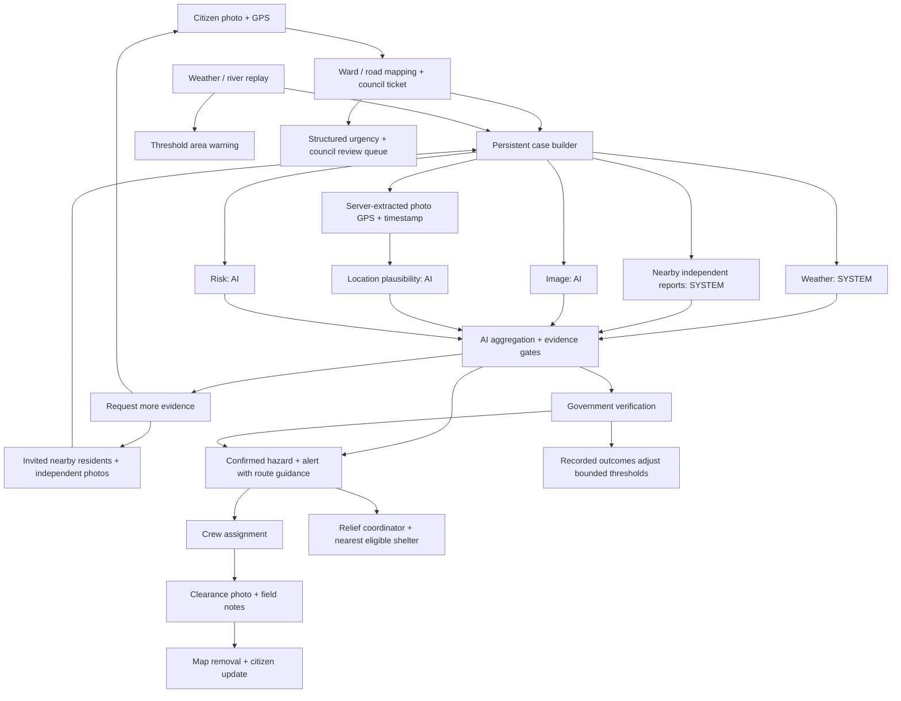

# CrysisConnect — CodeArena 26

A disaster-response platform for citizen photo reports, evidence verification, area warnings, crew dispatch and relief coordination. It targets **Topic 04** of the CodeArena 26 ideathon brief.

## Run the local workflow

Use Node.js 22 or later.

```sh
npm ci --legacy-peer-deps
npm run dev
```

Open the response portals:

- [Citizen reports](http://localhost:3000/citizen/hazards): submit a photo and GPS location, request help, supply additional evidence and track status.
- [Government review](http://localhost:3000/admin/hazards): review by urgency, ward and council; request nearby confirmation, moderate false reports and dispatch crews.
- [NGO field queue](http://localhost:3000/ngo/hazards): inspect assigned cases and close them with a **new** clearance photo and field notes.
- [Relief coordinator](http://localhost:3000/relief/hazards): allocate assistance and the nearest eligible shelter, inspect screened route guidance and release reservations.
- [Public map](http://localhost:3000/public-map): view confirmed hazards, warnings and shelters without signing in. Private report details and photos are omitted.

Without cloud configuration, development uses clearly labeled demo identities and durable `.data/hazards.json` storage. All portals share the same persisted cases. The citizen selector includes two nearby residents for independent confirmation. Demo shelters, three wards, two councils and roads are synthetic fixtures.

```sh
npm run weather:replay
```

The replay sends simulated normal and flood-level gauge readings to the running backend. Flood thresholds create an area warning and verification case even when no citizen has reported a hazard.

## Evidence workflow



Gemini runs only on the backend. With a configured `GEMINI_API_KEY`, image, location and risk checks feed a structured aggregator with an urgency level. The server compares embedded photo GPS with the claimed location; missing metadata stays explicit, and conflicting GPS or community observations require human review. An unconfigured, uncovered or ambiguous geographic lookup also blocks automatic confirmation until human review. Photo metadata is editable and is not proof of authenticity. Without a key, or if a check fails, the app shows unavailable checks and requires human verification. Confidence is an uncalibrated model estimate.

Nearby alerts automatically include screened route guidance for residents sharing a current location. Complete road segments are checked against recorded hazards. Provider failures, intersecting routes, unknown geometry or full shelters yield an explicit unavailable result. If a household starts inside a hazard buffer, relief allocation can reserve a shelter while clearly requiring crew-assisted extraction; it does not invent an evacuation path.

Ward polygons assign a responsible council automatically. Operators can filter queues and correct council assignment. Live deployments accept verified geography through `HAZARD_GEOGRAPHY_FILE` or `HAZARD_GEOGRAPHY_JSON`, and restrict council staff through verified Cognito groups. Government reviewers can ban reporting after recording a false-report decision and can lift the ban with an audit reason.

## Platform capabilities

- AWS Cognito, AppSync subscriptions, Lambda, PostgreSQL/PostGIS, S3 and Terraform infrastructure.
- Government disaster polygons, geofenced SMS/email, safe zones and operational dashboards.
- Citizen SOS and resource requests; NGO response and inventory workflows.
- Flutter Android citizen app. SOS errors remain unconfirmed; routes are screened against current disaster polygons and the shared hazard API.

The new `/api/hazards` service runs in the Next.js **Node server**. Live deployments use verified Cognito identities and PostgreSQL state. Existing AppSync operations remain available; new hazard notifications are persisted **in-app broadcasts**, not automatic SMS sends.

## Checks

```sh
npm run typecheck
npm test
npm run build
npx playwright install chromium
npm run test:e2e
npm run verify:live
```

Android:

```sh
cd citizen_android_app
flutter pub get
flutter analyze
flutter test
```

`verify:live` inventories configuration without network calls. Use `npm run verify:live -- --live` after configuring credentials to exercise the real adapters. Live model quality, cloud operation and verified geographic data still require deployment validation.

See [configuration and deployment](docs/codearena26-setup.md), [demo walkthrough](docs/demo-script.md), [requirements mapping](docs/codearena26-requirements.md), and [live validation](docs/live-validation.md).
