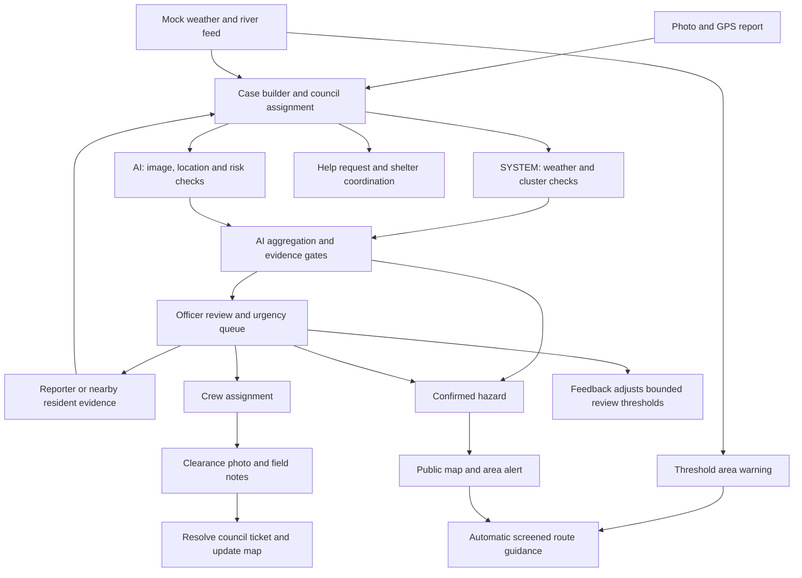

# CrysisConnect — CodeArena 26

CrysisConnect coordinates disaster response across citizens, council officers, field crews and relief teams. It addresses **Topic 04: Coordinating city response to floods and road hazards** through photo reports, evidence verification, area warnings, shelter allocation and photographic closure.

## Quick start

Use Node.js 22 or later:

```sh
npm ci --legacy-peer-deps
npm run dev
```

Open [localhost:3000](http://localhost:3000) or a portal below:

| Portal | What you can do |
| --- | --- |
| [Citizen reports](http://localhost:3000/citizen/hazards) | Report a hazard with photo/GPS, request help, contribute nearby observations and receive area alerts. |
| [Government review](http://localhost:3000/admin/hazards) | Review by urgency, ward and council; request evidence, moderate reports and dispatch crews. |
| [NGO field queue](http://localhost:3000/ngo/hazards) | View assigned cases and submit a distinct clearance photo with field notes. |
| [Relief coordinator](http://localhost:3000/relief/hazards) | Allocate supplies and shelter places, inspect route guidance and release reservations. |
| [Public map](http://localhost:3000/public-map) | View active hazards, warnings and shelters without signing in. |

With Cognito unconfigured, development mode provides labeled demo identities and saves shared state in `.data/hazards.json`. The citizen selector includes two nearby-resident identities for community verification. Demo wards, councils, roads and shelters are synthetic and labeled accordingly.

While the server is running, replay simulated weather and river readings:

```sh
npm run weather:replay
```

A threshold breach creates an area warning and verification case independently of citizen reports.

## Features

- **Photo and GPS reports:** submit hazards and assistance requests, add evidence and follow case status.
- **Geographic assignment:** map coordinates to configured wards, nearby roads and responsible councils; filter queues and correct council ownership.
- **Evidence assessment:** run weather and distinct-reporter cluster checks in backend code, plus Gemini image, location and risk checks. A structured aggregator provides reasons, confidence and urgency.
- **Photo metadata:** extract embedded GPS and capture-time information on the server and compare it with the reported location.
- **Community confirmation:** invite opted-in nearby residents to submit independent photos and supporting or contradicting observations.
- **Automatic alert guidance:** attach screened routes to nearby alerts using a resident's shared location.
- **Response and relief:** assign crews, reserve the nearest eligible shelter with capacity, record supplies and close hazards with photographic evidence.
- **Administration:** restrict officers and coordinators by council, record human review decisions, and apply or lift reporting bans with an audit trail.
- **Public updates:** refresh the anonymous hazard map without exposing private report text, photos, resident profiles or moderation records.

## Response workflow



Gemini runs on the server. Automatic confirmation requires complete AI checks, sufficient supporting evidence and resolved geography. Missing credentials or conflicting observations require human review before confirmation. Urgency supports prioritization; model confidence is an uncalibrated estimate. Embedded photo metadata is editable consistency evidence, so a GPS match alone does not establish authenticity.

Routes are screened along complete segments against recorded hazards and disaster boundaries. If an origin is inside a hazard or no usable route can be established, the app shows unavailable guidance. Relief can reserve an eligible shelter while explicitly requiring crew-assisted extraction. Shelter places remain reserved until a coordinator records their release.

## Technology and configuration

The web app uses Next.js, React, TypeScript, Tailwind CSS and MapLibre. The `/api/hazards` workflow runs on a Next.js **Node server**, with local JSON storage for demonstrations or PostgreSQL for live operation. Cloud components include Cognito authentication, AppSync, Lambda, S3, messaging services and Terraform infrastructure.

The Flutter Android app supports citizen SOS, resources and screened routing. Use the responsive web portals for the complete photo-report, review and closure workflow.

Configure server credentials and providers using [.env.example](.env.example) and the [setup guide](docs/codearena26-setup.md). Live operation requires Cognito, PostgreSQL, a routing provider and verified ward/road/shelter data; Gemini credentials enable AI assessment. Hazard broadcasts are in-app notifications. SMS/email delivery uses the government alert composer and its configured providers.

## Validation

```sh
npm run typecheck
npm test
npm run build
npx playwright install chromium
npm run test:e2e
```

Inventory live-service configuration without network calls:

```sh
npm run verify:live
```

After configuring the services, run `npm run verify:live -- --live` to exercise the actual adapters. Automated tests use controlled providers; deployment validation and live model quality require configured services. See [live validation](docs/live-validation.md) for the checks and their scope.

For Android:

```sh
cd citizen_android_app
flutter pub get
flutter analyze
flutter test
```

## Documentation

- [Setup and deployment](docs/codearena26-setup.md)
- [Demo walkthrough](docs/demo-script.md)
- [Topic 04 requirements mapping](docs/codearena26-requirements.md)
- [Live-service validation](docs/live-validation.md)
- [Android setup](citizen_android_app/README.md)
