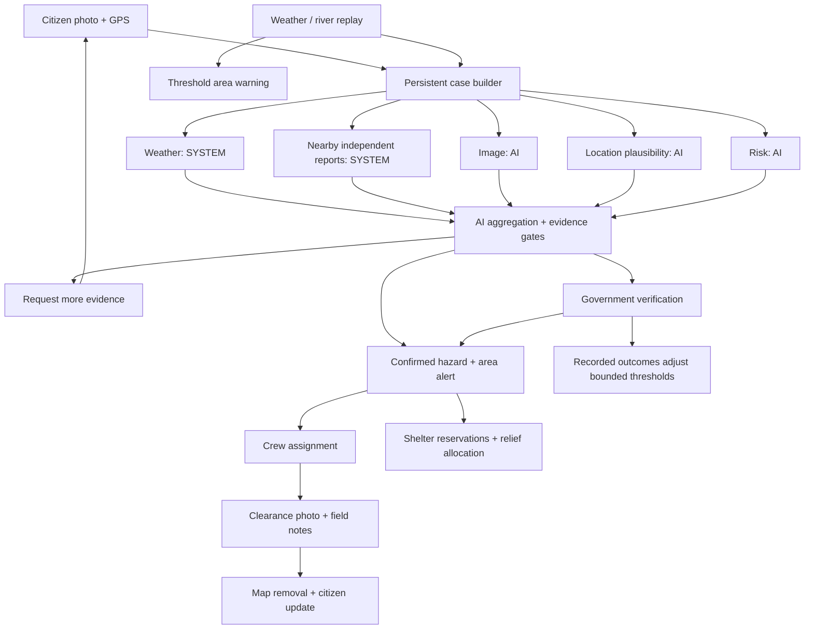

# CrysisConnect — CodeArena 26

A disaster-response platform for citizen photo reports, evidence verification, area warnings, crew dispatch and relief coordination. It targets **Topic 04** of the CodeArena 26 ideathon brief.

## Run the local workflow

Use Node.js 22 or later.

```sh
npm ci --legacy-peer-deps
npm run dev
```

Open three tabs:

- [Citizen reports](http://localhost:3000/citizen/hazards): submit a photo and GPS location, request help, supply additional evidence and track status.
- [Government review](http://localhost:3000/admin/hazards): inspect five checks, request more information, confirm/reject reports, assign a crew and allocate shelter places.
- [NGO field queue](http://localhost:3000/ngo/hazards): inspect assigned cases and close them with a **new** clearance photo and field notes.

Without cloud configuration, development uses clearly labeled demo identities and durable `.data/hazards.json` storage. All three portals share the same persisted cases. Demo shelters are sample locations, not verified operating facilities.

```sh
npm run weather:replay
```

The replay sends simulated normal and flood-level gauge readings to the running backend. Flood thresholds create an area warning and verification case even when no citizen has reported a hazard.

## Evidence workflow



Gemini runs only on the backend. With a configured `GEMINI_API_KEY`, image, location and risk checks feed a structured aggregator. Without a key, or if a check fails, the app shows unavailable checks and requires human verification. Confidence is a model estimate, not calibrated accuracy. It is never replaced with a fixed success percentage.

Road candidates are checked along their complete segments against recorded hazards. Provider failures, intersecting routes, unknown geometry or full shelters yield no screened route. Local demo destinations are identified as fixtures.

## Platform capabilities

- AWS Cognito, AppSync subscriptions, Lambda, PostgreSQL/PostGIS, S3 and Terraform infrastructure.
- Government disaster polygons, geofenced SMS/email, safe zones and operational dashboards.
- Citizen SOS and resource requests; NGO response and inventory workflows.
- Flutter Android citizen app. SOS errors remain unconfirmed; routes are screened against current disaster polygons and the shared hazard API.

The new `/api/hazards` service runs in the Next.js **Node server**. Live deployments use verified Cognito identities and PostgreSQL state. Existing AppSync operations remain available; new hazard notifications are persisted **in-app broadcasts**, not automatic SMS sends.

## Checks

```sh
npm run typecheck
npm test
npm run build
npx playwright install chromium
npm run test:e2e
```

Android:

```sh
cd citizen_android_app
flutter pub get
flutter analyze
flutter test
```

See [configuration and deployment](docs/codearena26-setup.md), [demo walkthrough](docs/demo-script.md), [requirements mapping](docs/codearena26-requirements.md), and [implementation plan](docs/codearena26-plan.md).
